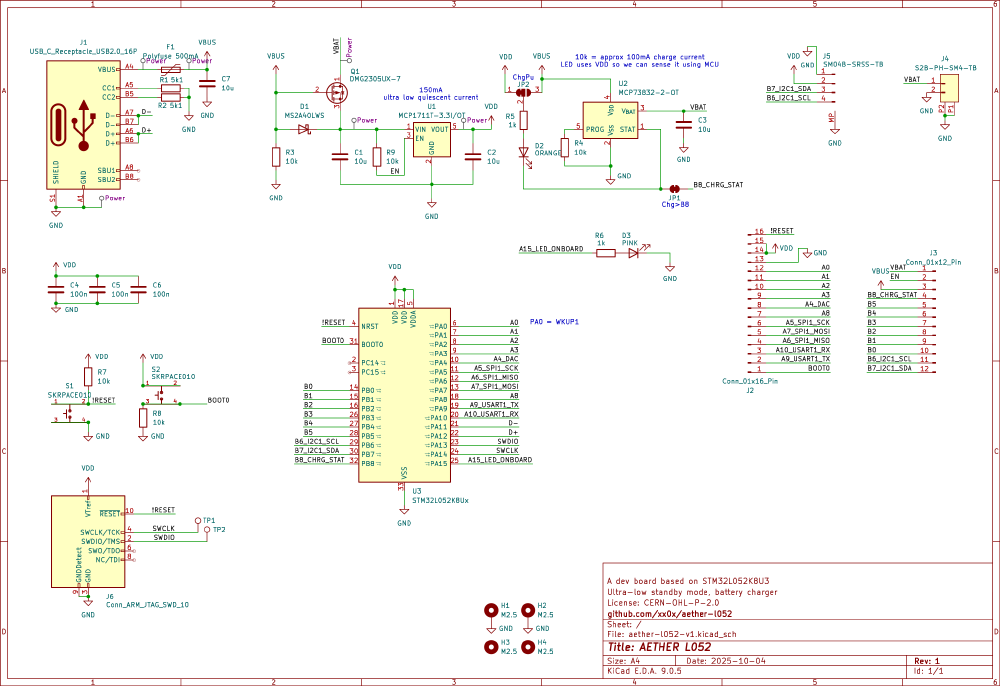
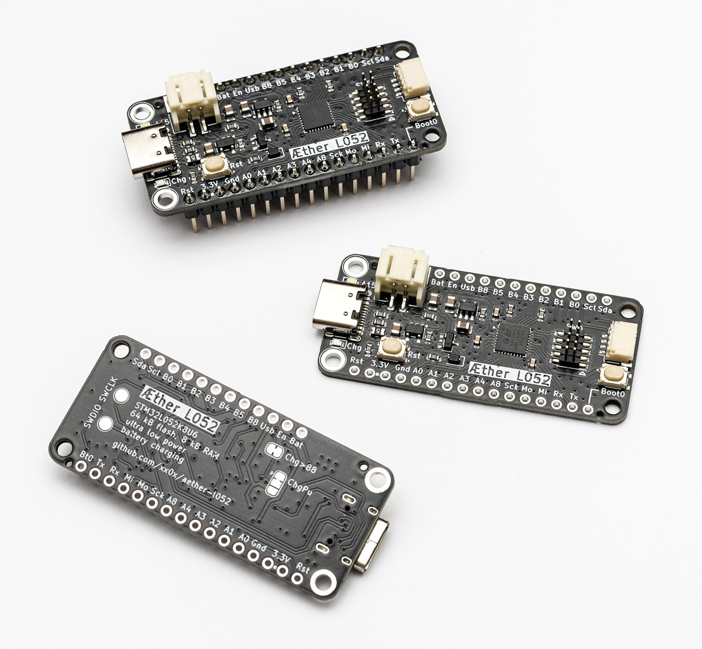

# Æther L052

A development board based on STM32L052K8U3 chip, optimized for low power applications. Form factor based on and compatible with Adafruit Feather series.

## Specs

### Microcontroller

| Name             | STM32L052K8U3       |
| ---------------- | ------------------- |
| Core             | ARM Cortex M0+      |
| Flash Size       | 64 kB               |
| RAM Size         | 8 kB                |
| Clock Frequency  | 32 MHz              |
| Peripherals      | USB, SPI, I2C, UART |
| External Crystal | None                |

### Voltage Regulator

| Name              | MCP1711T-33I/OT |
| ----------------- | --------------- |
| Output Voltage    | 3.3 V           |
| Output Current    | 150 mA          |
| Quiescent Current | 600 nA          |

### Lithium Battery Charger

| Name           | MCP73832T-2ACI/OT     |
| -------------- | --------------------- |
| Charge Current | 100 mA (set using R4) |
| Charge State   | Available through PB8 |

## Schematic

## Photo

## Where to get?

Æther L052 is an open-source board, not available through any shops. Feel free to order your own board, all necessary files are at "pcb" folder.

## Code examples

Look at the [STM32 L052 examples](https://github.com/xx0x/stm32-l052-examples) repository.

## License

CERN-OHL-P-2.0 license

